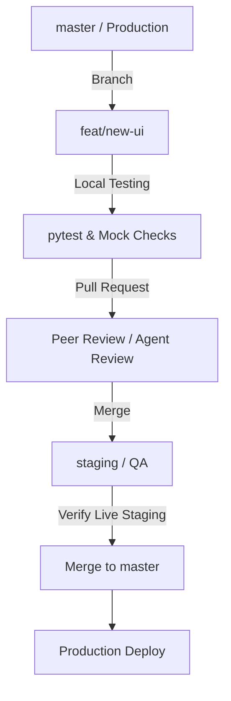

# TaxGrieve NY: Software Development Lifecycle (SDLC) & Best Practices

As TaxGrieve scales to support production users and multiple human/AI collaborators, establishing a structured, secure, and cost-effective development pipeline is critical. This document defines the SDLC guidelines and operational best practices for the project.

---

## 🗺️ 1. Environment Segregation

We maintain three distinct environments to ensure stability:

| Environment | Purpose | Database | Host Platform | DNS Target |
| :--- | :--- | :--- | :--- | :--- |
| **Development** | Local coding, testing, and debugging. | SQLite (`grievance_data.db`) | Local localhost:8080 | N/A |
| **Staging** | Peer testing, QA, and integration checks. | Postgres (Staging DB) | Cloud Run (`nygriever-staging`) | `staging.griever.johnnylehane.com` |
| **Production** | Live system serving real property owners. | Postgres (Prod Cloud SQL) | Cloud Run (`nygriever`) | `griever.johnnylehane.com` |

---

## 🌿 2. Git Branching & Merging Strategy

We follow a simplified **GitHub Flow** model. Direct commits to `master` (production) are strictly prohibited.



### Branch Naming Conventions
*   `feat/feature-name` — New capabilities or features.
*   `fix/bug-name` — Bug fixes.
*   `chore/task-name` — Updates to dependencies, docs, or configs.

### The Lifecycle of a Change
1.  **Branch:** Create a branch from `master` (e.g., `git checkout -b feat/municipal-dates`).
2.  **Code & Local Test:** Implement changes and run unit tests.
3.  **Pull Request (PR):** Push your branch to GitHub and open a PR.
4.  **Staging Deployment:** Deploy the branch to the `nygriever-staging` Cloud Run instance.
5.  **Peer Review:** Collaborators (human or AI) must verify the staging deployment.
6.  **Production Release:** Once approved, merge the PR into `master` and deploy to the production `nygriever` service.

---

## 🔑 3. Secret & API Key Management

Hardcoding API keys or committing `.env` files is a high-risk security hazard. 

### Local Development
*   Store all local variables in a `.env` file (gitignored via `.gitignore`).
*   Example `.env` template:
    ```bash
    RAPIDAPI_KEY=your_local_dev_key
    DATABASE_URL=  # Leave blank to automatically fallback to local SQLite
    MOCK_REAL_ESTATE=true  # Saves money by simulating API calls locally
    ```

### Cloud Environments (Staging & Production)
*   **Do not pass keys in deployment scripts** (e.g., avoid `--set-env-vars="RAPIDAPI_KEY=abc..."` in shell scripts).
*   **GCP Secret Manager:** Store `RAPIDAPI_KEY` and `DATABASE_URL` in Google Cloud Secret Manager.
*   Reference the secrets directly in your Cloud Run configurations:
    ```bash
    gcloud run services update nygriever \
      --set-secrets="RAPIDAPI_KEY=rapidapi-key:latest,DATABASE_URL=postgres-db-url:latest"
    ```

---

## 💰 4. RapidAPI Cost Control & Local Mocking

To prevent unexpected billing or rate limit exhaustion during development and local testing, the codebase supports a **Mock Mode**.

### Rule: Always Develop with Mocks
When running local tests or writing new feature code, configure the Zillow API fetcher to check the `MOCK_REAL_ESTATE` environment variable. If set to `true`:
1.  Intercept outbound HTTP requests to RapidAPI.
2.  Return a static mock JSON payload (like the tracked `discovery_results.json` file).
3.  **Benefit:** $0 API usage during active development, faster tests, and deterministic data.

---

## 🧪 5. Testing & Verification Requirements

No PR may be merged into `master` without passing verification.

### Run Local Tests
Run `pytest` to execute unit and integration tests before pushing:
```bash
# Set up environment and run tests
export MOCK_REAL_ESTATE=true
pytest tests/
```

### Add Test Coverage
*   Any new feature must include a corresponding unit test under `/tests`.
*   Bug fixes should include a regression test that fails without the fix and passes with it.

---

## 🤖 6. Collaboration Rules for AI Coding Agents

When delegating tasks to AI agents (like Antigravity or Jules), enforce these instructions:
1.  **Strict Sandbox Isolation:** The agent must always work on a branched workspace (`branch` mode), never directly on the active repository branch.
2.  **Mandatory Test Runs:** The agent must execute `pytest` successfully before declaring a task done.
3.  **Documentation:** The agent must generate/update a `walkthrough.md` summarizing the changes, files modified, and verification steps.
4.  **No Direct Deployments:** The agent may deploy to the *staging* environment for verification, but must never deploy directly to production.
